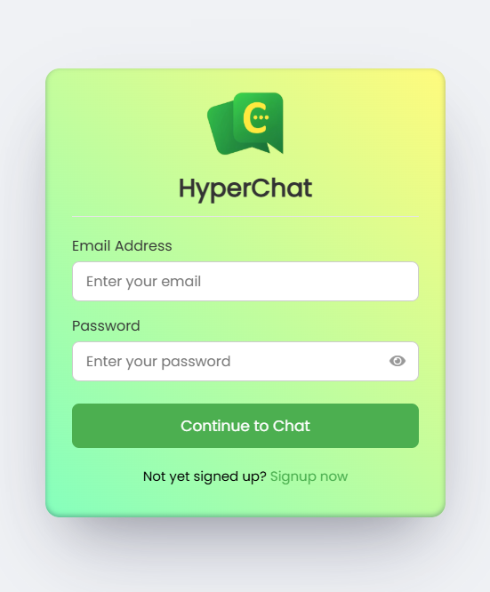
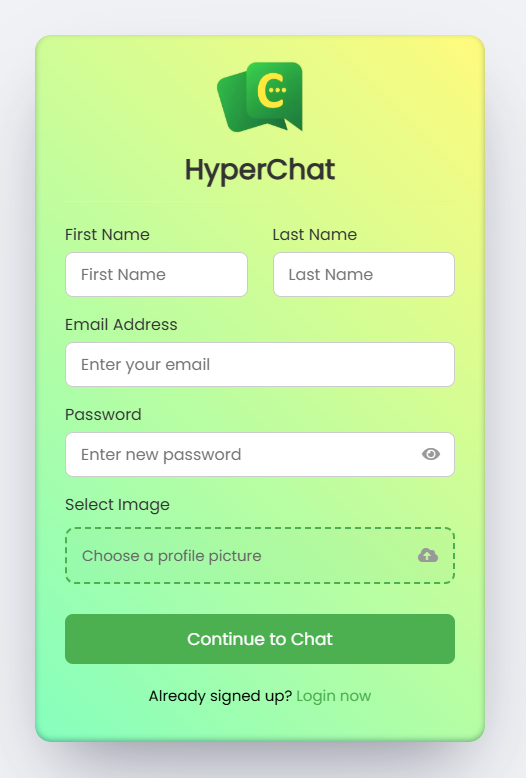
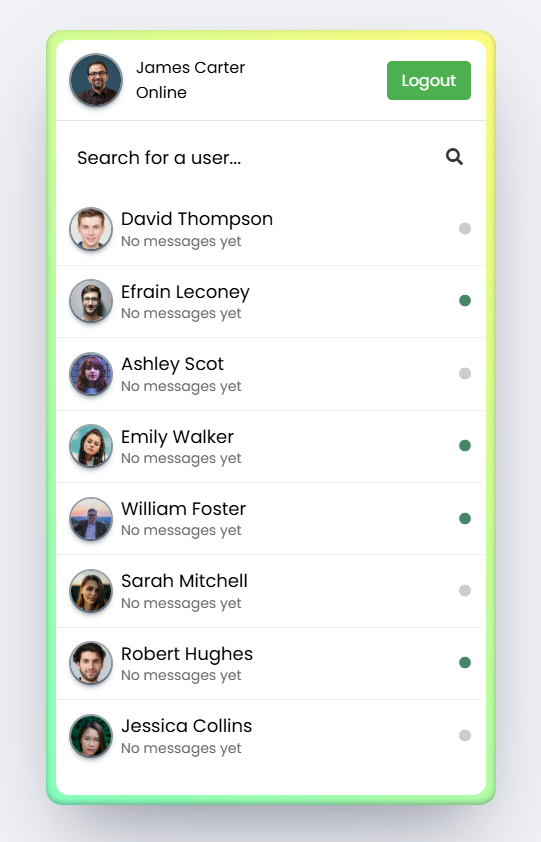
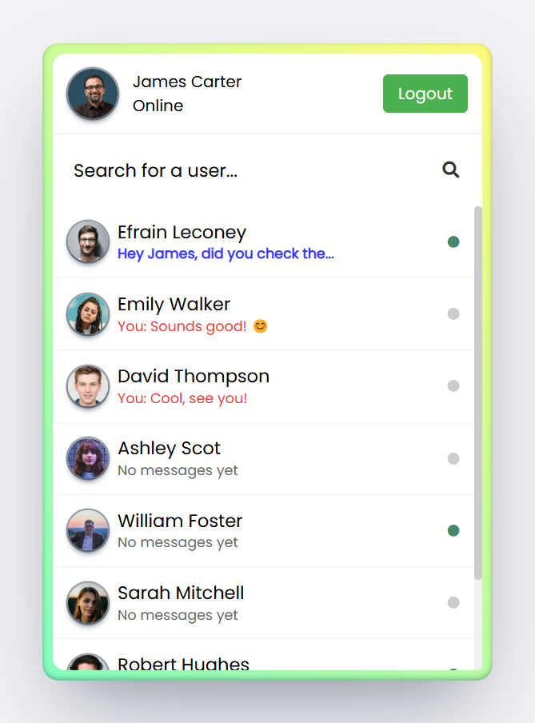
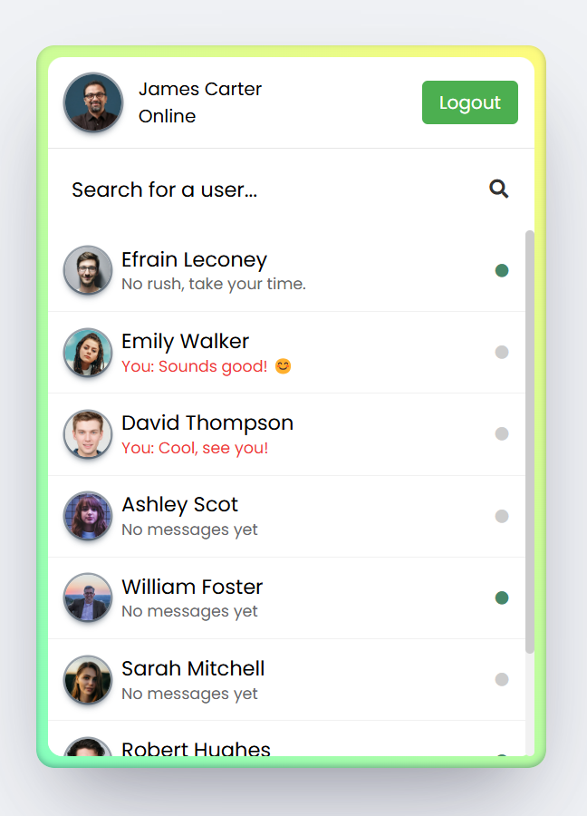
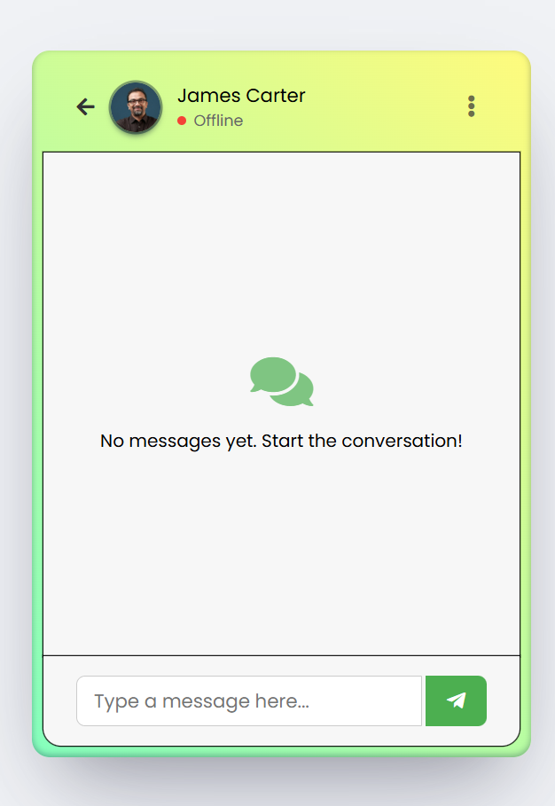
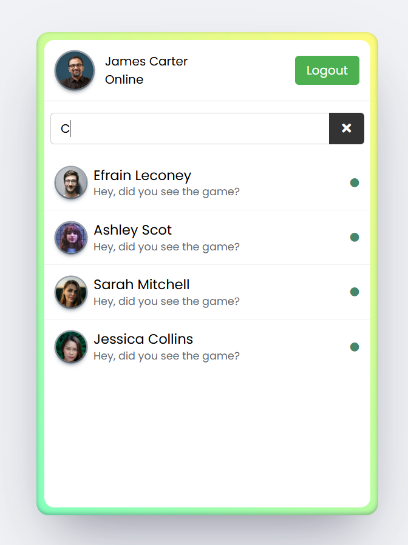

# 💬HyperChat [[Live Preview](https://hyper-chat-app.onrender.com/login.php)]

HyperChat is a messaging application developed using PHP and Firebase, designed to provide real-time communication with features like user presence and secure authentication.

#### Login Screen



#### Signup Screen



#### User Dashboard

<div>



</div>

#### Chat Interface



#### User Search



<br>

## Version History

HyperChat has transitioned from a traditional PHP/MySQL setup to a more modern Firebase-based platform.

### Current Firebase Version

- Real-time data storage using Cloud Firestore.
- User authentication managed by Firebase Authentication.
- Real-time presence tracking for accurate online status.
- Updated user interface with custom branding.
- Progressive Web App (PWA) functionality.
- Enhanced performance and reliability.

<details>
<summary><b>Previous Version</b> (Click to expand)</summary>

- MySQL database for data storage.
- PHP session-based authentication.
- AJAX polling for message updates.
- Basic online status tracking.
- Simple user interface.

#### Legacy Login Screen


#### Legacy User Dashboard


#### Legacy Chat Interface


#### Legacy User Search


</details>

<br>

## Key Features

### Core Functionality

- Firebase Authentication for user management.
- Real-time messaging using Firestore.
- User search capabilities.
- Presence system indicating online/offline status.

### User Interface

- Responsive design.
- Profile management with avatars.
- Modern user interface.
- Enhanced search functionality.
- Clean design aesthetics.

<br>

## Technology Stack

### Core Technologies

- PHP (Backend)
- Firebase:
  - Authentication
  - Firestore Database
  - Cloud Storage
  - Hosting
- HTML5 & CSS3
- JavaScript (ES6+)
- Progressive Web App features.

<br>

## Getting Started

### Prerequisites

- PHP 7.4+
- Web server (Apache/Nginx)
- Modern web browser.
- Firebase account.

### Installation

1. Clone the repository:

   ```sh
   git clone https://github.com/VinayShetyeOfficial/hyper-chat-app.git
   ```

2. Start your local server:

   ```sh
   php -S 0.0.0.0:8000
   ```

3. Access the application:
   ```
   http://localhost:8000
   ```

<br>

## 💬 Chat Features

### Message Management

- Real-time message delivery with Firestore
- Message history with efficient data loading
- Read receipts for message tracking

### User Features

- Secure authentication with Firebase
- Accurate online/offline status
- User search with instant results
- Profile image storage in Firebase

<br>

## 🔐 Security Features

- Firebase Authentication for secure user management
- Secure data storage with Firestore security rules
- Protected image uploads
- Session management
- Input validation and sanitization
- XSS protection measures

<br>

## 🛠️ Possible Future Enhancements

- Group chats with multiple participants
- Voice messages and audio recording
- Video calls integration
- End-to-end encryption for private messages
- Message reactions with emojis
- Custom themes and appearance settings
- Push notifications for new messages
- Message search functionality
- Message deletion and editing

<br>

## 🤝 Contributing

Contributions are welcome! Please feel free to submit a Pull Request.

1. Fork the project
2. Create your feature branch:
   ```sh
   git checkout -b feature/AmazingFeature
   ```
3. Commit your changes:
   ```sh
   git commit -m 'Add some AmazingFeature'
   ```
4. Push to the branch:
   ```sh
   git push origin feature/AmazingFeature
   ```
5. Open a Pull Request

<br>

## 📧 Contact

Vinay Shetye - [GitHub](https://github.com/VinayShetyeOfficial) - vinay.shetye.personal@outlook.com <br>
Project Link: [https://github.com/VinayShetyeOfficial/hyper-chat-app](https://github.com/VinayShetyeOfficial/hyper-chat-app)
